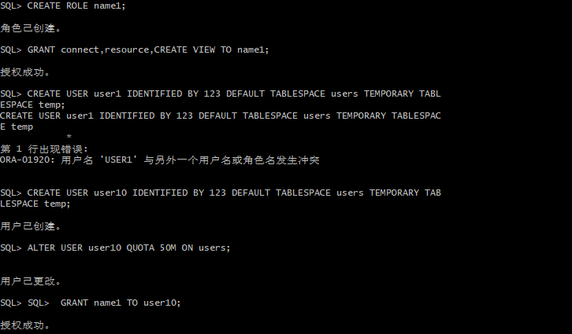
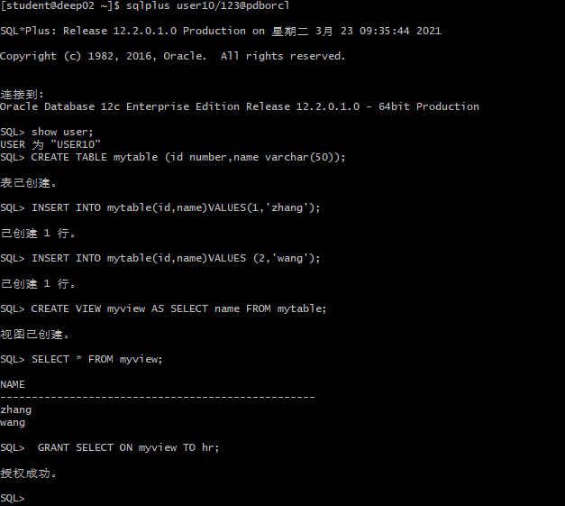
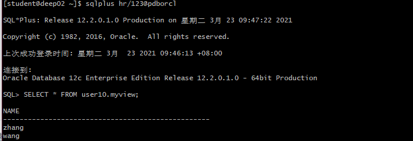
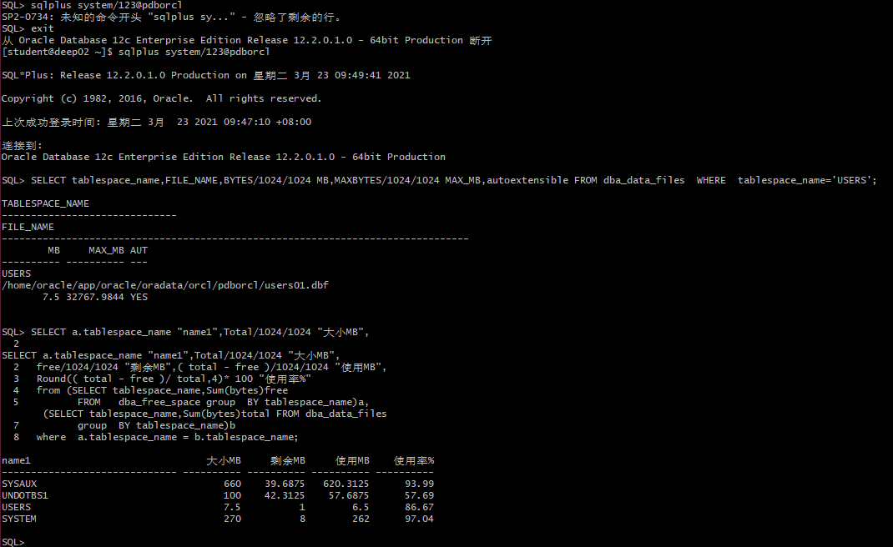
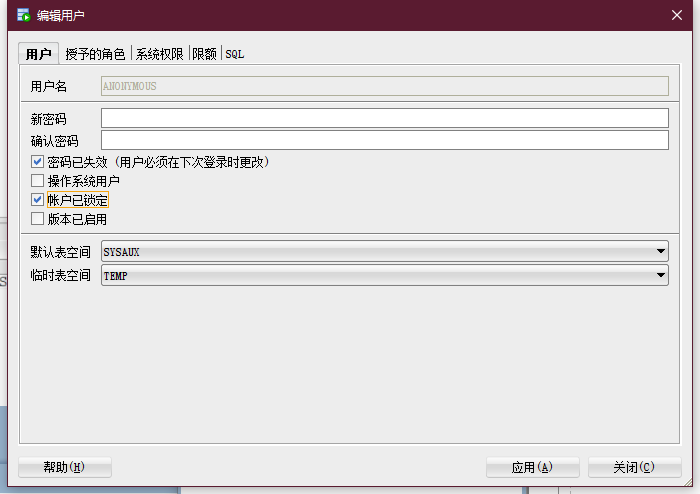
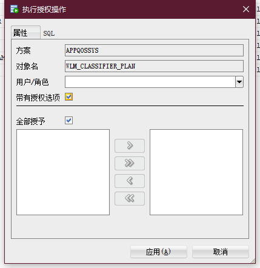

# oracle

### 1.完成对象name1 和user10的创建，并授权和分配空间

### 2.新用户user10连接到pdborcl，创建表mytable和视图myview，插入数据，最后将myview的SELECT对象权限授予hr用户。

#### 3.用户hr连接到pdborcl，查询new_user授予它的视图myview

#### 4.以下样例查看表空间的数据库文件，以及每个文件的磁盘占用情况。

#### 5.SQL-DEVELOPER修改用户的操作界面

#### 6.sqldeveloper授权对象的操作界面

