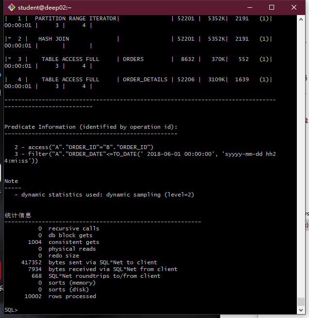

# work3

#### 首先创建自己的账号your_user，然后以system身份登录:


```
[student@deep02 ~]$sqlplus system/123@localhost/pdborcl
SQL>ALTER USER user100 QUOTA UNLIMITED ON USERS;
SQL>ALTER USER user100 QUOTA UNLIMITED ON USERS02;
SQL>ALTER USER user100 QUOTA UNLIMITED ON USERS03;
SQL>exit
```

#### 然后以自己的账号your_user身份登录,并运行脚本文件test3.sql:

```
[student@deep02 ~]$cat test3.sql
[student@deep02 ~]$sqlplus user100/123@localhost/pdborcl
SQL>@test3.sql
SQL>exit
```

运行结果




