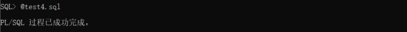
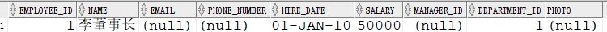
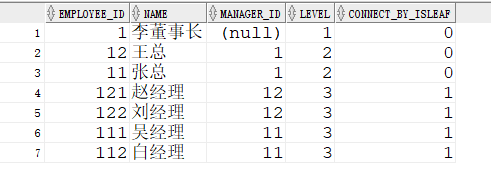
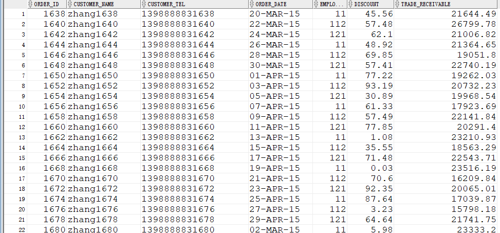
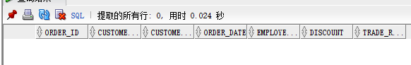
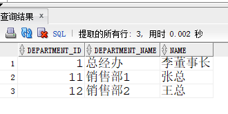
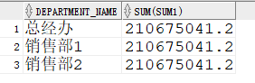

# 实验4：对象管理

## 姓名：罗正义，学号：201810414118

## 实验目的：

了解Oracle表和视图的概念，学习使用SQL语句Create Table创建表，学习Select语句插入，修改，删除以及查询数据，学习使用SQL语句创建视图，学习部分存储过程和触发器的使用。

## 实验场景：

假设有一个生产某个产品的单位，单位接受网上订单进行产品的销售。通过实验模拟这个单位的部分信息：员工表，部门表，订单表，订单详单表。

## 实验内容：

### 录入数据：

要求至少有1万个订单，每个订单至少有4个详单。至少有两个部门，每个部门至少有1个员工，其中只有一个人没有领导，一个领导至少有一个下属，并且它的下属是另一个人的领导（比如A领导B，B领导C）。

### 序列的应用

插入ORDERS和ORDER_DETAILS 两个表的数据时，主键ORDERS.ORDER_ID, ORDER_DETAILS.ID的值必须通过序列SEQ_ORDER_ID和SEQ_ORDER_ID取得，不能手工输入一个数字。

### 触发器的应用：

维护ORDER_DETAILS的数据时（insert,delete,update）要同步更新ORDERS表订单应收货款ORDERS.Trade_Receivable的值。

### 查询数据：

```
1.查询某个员工的信息
2.递归查询某个员工及其所有下属，子下属员工。
3.查询订单表，并且包括订单的订单应收货款: Trade_Receivable= sum(订单详单表.ProductNum*订单详单表.ProductPrice)- Discount。
4.查询订单详表，要求显示订单的客户名称和客户电话，产品类型用汉字描述。
5.查询出所有空订单，即没有订单详单的订单。
6.查询部门表，同时显示部门的负责人姓名。
7.查询部门表，统计每个部门的销售总金额。
```

1. 表结构分析

- 部门表DEPARTMENTS,表空间：USERS

| 编号 | 字段名          | 数据类型          | 可以为空 | 注释           |
| ---- | --------------- | ----------------- | -------- | -------------- |
| 1    | DEPARTMENT_ID   | NUMBER(6,0)       | NO       | 部门ID，主键   |
| 2    | DEPARTMENT_NAME | VARCHAR2(40 BYTE) | NO       | 部门名称，非空 |

- 产品表PRODUCTS,表空间：USERS

| 编号 | 字段名       | 数据类型          | 可以为空 | 注释                               |
| ---- | ------------ | ----------------- | -------- | ---------------------------------- |
| 1    | PRODUCT_NAME | VARCHAR2(40 BYTE) | NO       | 产品名称，产品表的主键             |
| 2    | PRODUCT_TYPE | VARCHAR2(40 BYTE) | NO       | 产品类型，只能取值：耗材,手机,电脑 |

- 员工表EMPLOYEES,表空间：USERS

| 编号 | 字段名        | 数据类型          | 可以为空 | 注释                                                         |
| ---- | ------------- | ----------------- | -------- | ------------------------------------------------------------ |
| 1    | EMPLOYEE_ID   | NUMBER(6,0)       | NO       | 员工ID，员工表的主键。                                       |
| 2    | NAME          | VARCHAR2(40 BYTE) | NO       | 员工姓名，不能为空，创建不唯一B树索引。                      |
| 3    | EMAIL         | VARCHAR2(40 BYTE) | YES      | 电子信箱                                                     |
| 4    | PHONE_NUMBER  | VARCHAR2(40 BYTE) | YES      | 电话                                                         |
| 5    | HIRE_DATE     | DATE              | NO       | 雇佣日期                                                     |
| 6    | SALARY        | NUMBER(8,2)       | YES      | 月薪，必须>0                                                 |
| 7    | MANAGER_ID    | NUMBER(6,0)       | YES      | 员工的上司，是员工表EMPOLYEE_ID的外键，MANAGER_ID不能等于EMPLOYEE_ID,即员工的领导不能是自己。主键删除时MANAGER_ID设置为空值。 |
| 8    | DEPARTMENT_ID | NUMBER(6,0)       | YES      | 员工所在部门，是部门表DEPARTMENTS的外键                      |
| 9    | PHOTO         | BLOB              | YES      | 员工照片                                                     |

- 订单表ORDERS, 表空间：分区表：USERS,USERS02

| 编号 | 字段名           | 数据类型          | 可以为空 | 注释                                                         |
| ---- | ---------------- | ----------------- | -------- | ------------------------------------------------------------ |
| 1    | ORDER_ID         | NUMBER(10,0)      | NO       | 订单编号，主键，值来自于序列：SEQ_ORDER_ID                   |
| 2    | CUSTOMER_NAME    | VARCHAR2(40 BYTE) | NO       | 客户名称，B树索引                                            |
| 3    | CUSTOMER_TEL     | VARCHAR2(40 BYTE) | NO       | 客户电话                                                     |
| 4    | ORDER_DATE       | DATE              | NO       | 订单日期，根据该属性分区存储：2015年及以前的数据存储在USERS表空间，2016年及以后的数据存储在USERS02表空间中。 |
| 5    | EMPLOYEE_ID      | NUMBER(6,0)       | NO       | 订单经手人，员工表EMPLOYEES的外键                            |
| 6    | DISCOUNT         | Number(8,2)       | YES      | 订单整体优惠金额。默认值为0                                  |
| 7    | TRADE_RECEIVABLE | Number(8,2)       | YES      | 订单应收货款，默认为0，Trade_Receivable= sum(订单详单表.Product_Num*订单详单表.Product_Price)- Discount |

- 订单详单表ORDER_DETAILS, 表空间：分区表：USERS,USERS02，分区参照ORDERS表。

| 编号 | 字段名        | 数据类型          | 可以为空 | 注释                                           |
| ---- | ------------- | ----------------- | -------- | ---------------------------------------------- |
| 1    | ID            | NUMBER(10,0)      | NO       | 本表的主键，值来自于序列：SEQ_ORDER_DETAILS_ID |
| 2    | ORDER_ID      | NUMBER(10,0)      | NO       | 所属的订单号，订单表ORDERS的外键               |
| 4    | PRODUCT_NAME  | VARCHAR2(40 BYTE) | NO       | 产品名称, 是产品表PRODUCTS的外键               |
| 5    | PRODUCT_NUM   | NUMBER(8,2)       | NO       | 产品销售数量，必须>0                           |
| 6    | PRODUCT_PRICE | NUMBER(8,2)       | NO       | 产品销售价格                                   |

1. 插入数据

```sql
# 登录自己的账号运行test4.sql进行数据插入
sqlplus user10/123@localhost/pdborcl
@test4.sql
```



1. 查询数据

```sql
# 1.查询名字含董事长的员工信息，通过模糊查询LIKE关键字以及%符号限定查询条件
    SELECT * FROM EMPLOYEES WHERE NAME LIKE '%董事长%';
```



```
-- 2.递归查询李董事长及其管理的下属和子下属，并按层级关系排序
SELECT employee_id, name, manager_id, level, CONNECT_BY_ISLEAF  
FROM EMPLOYEES  START WITH employee_id = 1
CONNECT BY PRIOR employee_id = manager_id 
order by level;
```



```sql
-- 3.查询订单表，并且包括订单的订单应收货款: Trade_Receivable= sum(订单详单表.ProductNum*订单详单表.ProductPrice)- Discount。
select * from ORDERS;
```



```sql
-- 4.查询订单详表，要求显示订单的客户名称和客户电话，产品类型用汉字描述。
select o.customer_name as 客户名称,o.customer_tel as 客户电话, p.product_type as 产品类型
from orders o,order_details d,products p
where o.order_id = d.order_id and d.product_name = p.product_name;
```


```sql
-- 5.查询出所有空订单，即没有订单详单的订单。
select * from ORDERS where ORDER_ID not in(select distinct ORDER_ID from ORDER_DETAILS); 
```



```sql
-- 6.查询部门表，同时显示部门的负责人姓名。
select d.*, e.NAME 
from DEPARTMENTS d, EMPLOYEES e,(select  distinct manager_id, department_id from employees where manager_id is not null)t 
where d.department_id = t.department_id and e.employee_id = t.manager_id;
```



```sql
-- 7.查询部门表，统计每个部门的销售总金额。
select d.department_name,SUM(sum1)
FROM (
select (d.product_num*d.product_price) sum1
from order_details d,orders o,departments d,employees e
WHERE d.department_id=e.department_id
and o.employee_id = e.employee_id
and o.order_id=d.order_id
),departments d
group by d.department_name;
```



## 实验总结：

了解Oracle表和视图的概念，学习使用SQL语句Create Table创建表，学习Select语句插入，修改，删除以及查询数据，学习使用SQL语句创建视图，学习部分存储过程和触发器的使用。
